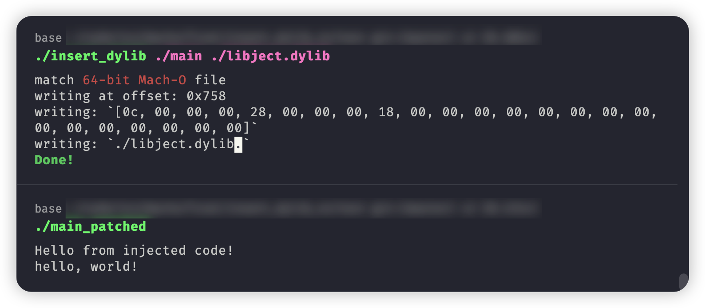
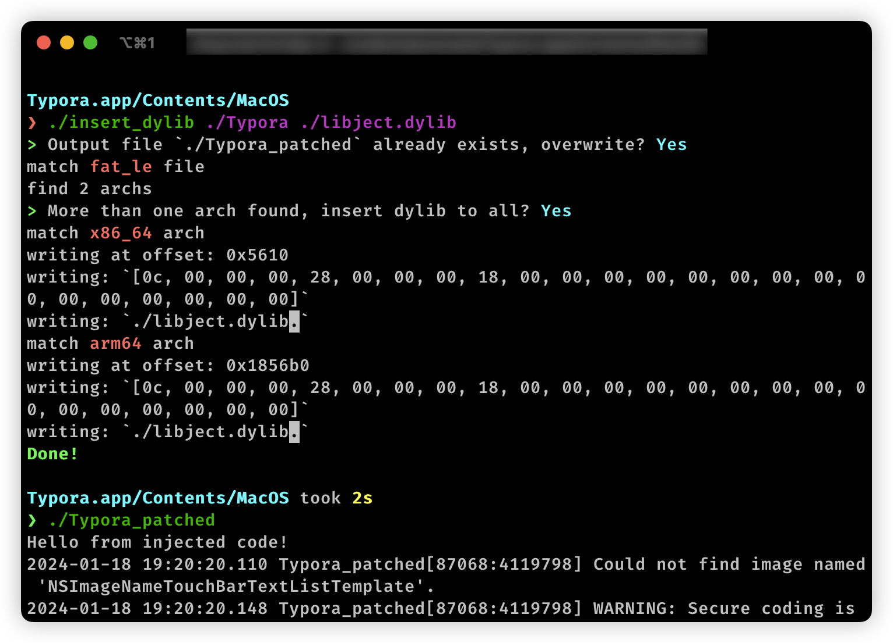

# insert_dylib_rs

[insert_dylib](https://github.com/Tyilo/insert_dylib) writen in rust

this cli is used to insert Load Dylib Command to macho file

### Usage:

```
Usage: insert_dylib [OPTIONS] <INPUT_FILE> <DYLIB>

Arguments:
  <INPUT_FILE>  The input file to be modified
  <DYLIB>       The dylib path to be inserted

Options:
  -i, --inplace         Modify the input file in place
  -y, --all-yes         Run without asking for confirmation
  -o <OUTPUT_FILE>      Output path
  -h, --help            Print help
```

### Example:

```sh
cd test
rustc main.rs -o main
rustc inject.rs --crate-type=cdylib -o libject.dylib
./insert_dylib ./main ./libject.dylib
```




### Test

| |64bit macho|32bit macho|fat_be|fat_le|
|:-:|:-:|:-:|:-:|:-:|
|m1|✅|❌|⭕|✅|
|intel|⭕|❌|⭕|⭕|

### More

If one file is injected, it will need to be re-codesigned. Otherwise it may not run.